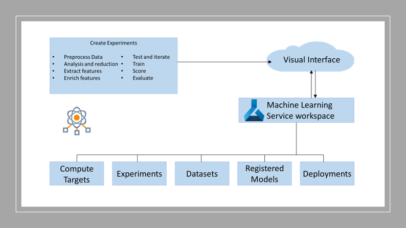

# Azure Machine Learning service using the Visual Interface
The Azure Machine Learning visual interface (currently available in preview) helps you build and train highly accurate machine learning and deep-learning models yourself in an Azure Machine Learning service Workspace.

## Resources
* [Azure Machine Learning Service Documentation](https://docs.microsoft.com/en-us/azure/machine-learning/service/)
* [Quickstart: Prepare and visualize data without writing code in Azure Machine Learning](https://docs.microsoft.com/en-us/azure/machine-learning/service/ui-quickstart-run-experiment)
* [Presentation: Overview](./docs/AML-visual-interface.pdf "AMLVI presentation pdf")
* [Video: Azure ML Visual Interface Introduction](https://www.microsoft.com/en-us/videoplayer/embed/RE2X1GY)
